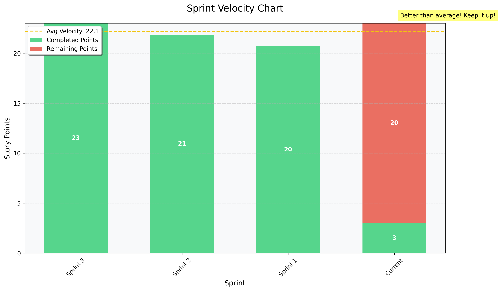
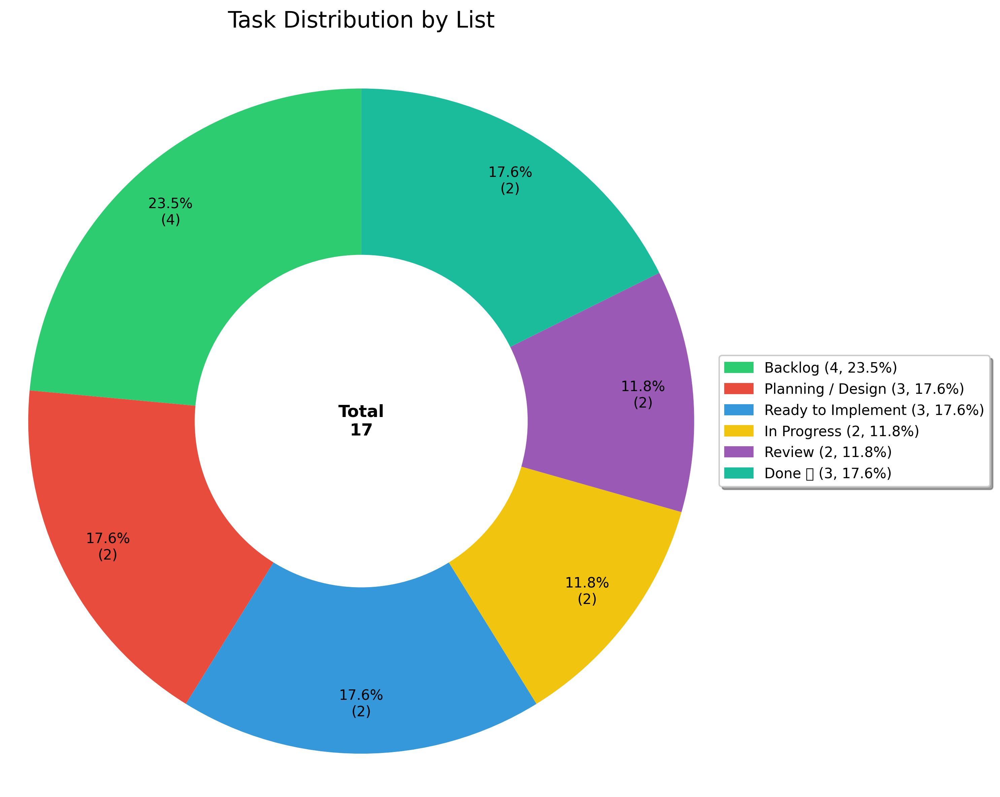

# Scrum Report: 
*Generated on 2025-04-08 23:59*

# Executive Summary
---

The team has completed **17.6%** of the sprint tasks with a velocity of **23.0** story points.

⚠️ **CRITICAL**: The completion rate is concerning and requires immediate attention.

🚫 **BLOCKERS**: There are **3** active blockers that need immediate attention.

## Key Metrics
---

**Sprint**: 
**Completion Rate**: 17.6%
**Velocity**: 23.0 story points (stable)
**Tasks**: 3/17 completed
**Remaining**: 14 tasks
**Blockers**: 3

# Sprint Progress & Analytics
---

## Sprint Burndown

*This chart shows the team's progress in completing story points over the sprint duration.*

## Velocity Trend

*This chart displays the team's velocity compared to previous sprints, helping forecast future capacity.*

## Task Distribution

*This chart shows how tasks are distributed across different workflow stages, helping identify bottlenecks.*

## Sprint Timeline

*This timeline shows tasks with dependencies and highlights critical items that need attention.*

# Critical Blockers
---

🚨 **IMMEDIATE ACTION REQUIRED**

### 1. [Integration] CRM Syncing with HubSpot – Requested by sales for better lead tracking.
**Impact**: High - Blocking sprint progress
**Action Required**: Immediate escalation and resolution
**Due Date**: 2025-04-11

### 2. Bug Fix: Payment Processing Delay – Logs analyzed, fix being implemented.
**Details**: Add feature ABC to product
**Impact**: High - Blocking sprint progress
**Action Required**: Immediate escalation and resolution
**Due Date**: 2025-04-07

### 3. CRM Integration Development – Dev team setting up authentication flows.
**Impact**: High - Blocking sprint progress
**Action Required**: Immediate escalation and resolution

# Upcoming Deadlines
---

⏰ **Tasks Due Within 3 Days**

### UI Mockups for Dashboard Redesign – UX reviewed, waiting for front-end.
**Due**: Today
**Priority**: 🔴 Critical
**Assigned**: Unassigned
**Status**: Ready to Implement

### Technical Feasibility for HubSpot Integration – Engineering reviewing API limitations.
**Due**: Today
**Priority**: 🔴 Critical
**Assigned**: Unassigned
**Status**: Ready to Implement

### Define MVP Scope for Multi-User Access – What’s included in v1?
**Due**: Tomorrow
**Priority**: 🟠 High
**Assigned**: Unassigned
**Status**: Planning / Design

### Bug Fix: Payment Processing Delay – Logs analyzed, fix being implemented.
**Due**: Tomorrow
**Priority**: 🟠 High
**Assigned**: Nishan Baral
**Status**: Review

### [Integration] CRM Syncing with HubSpot – Requested by sales for better lead tracking.
**Due**: In 2 days
**Priority**: 🟡 Medium
**Assigned**: Nishan Baral
**Status**: Backlog

### API Design for CRM Syncing – Endpoint details finalized.
**Due**: In 2 days
**Priority**: 🟡 Medium
**Assigned**: adamsnb34
**Status**: In Progress

### Front-End Development for Dashboard Redesign – UI in progress.
**Due**: In 2 days
**Priority**: 🟡 Medium
**Assigned**: Unassigned
**Status**: Review

# Action Items & Recommendations
---

### 1. 🔴 Resolve blocker: [Integration] CRM Syncing with HubSpot – Requested by sales for better lead tracking.
**Priority**: Critical
**Details**: 
**Owner**: Team Lead

### 2. 🔴 Resolve blocker: Bug Fix: Payment Processing Delay – Logs analyzed, fix being implemented.
**Priority**: Critical
**Details**: Add feature ABC to product
**Owner**: Team Lead

### 3. 🔴 Resolve blocker: CRM Integration Development – Dev team setting up authentication flows.
**Priority**: Critical
**Details**: 
**Owner**: Team Lead

### 4. 🟠 Address Low Completion Rate
**Priority**: High
**Details**: Current completion rate is significantly below target (17.6% vs 70% target)
**Owner**: Scrum Master

### 5. 🟠 Focus on 7 approaching deadlines
**Priority**: High
**Details**: Multiple tasks due within 3 days need immediate attention
**Owner**: Team
